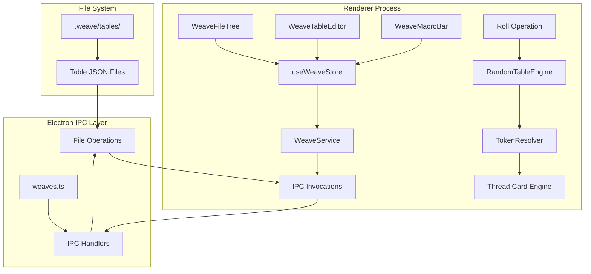
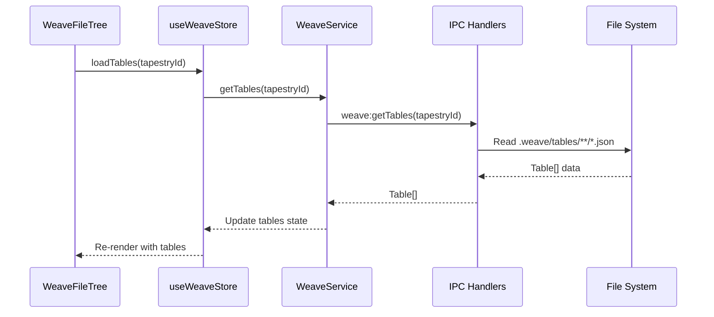
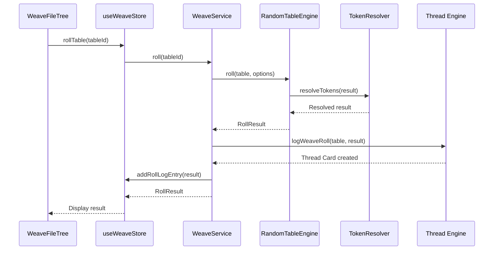
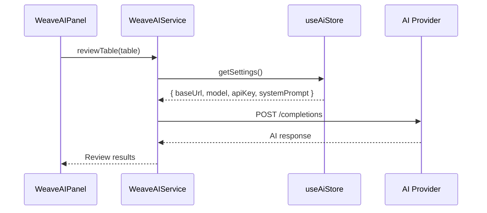

# The Weave Integration Plan for Anvil and Loom v2

**Date**: 2026-01-12
**Purpose**: Comprehensive integration plan for incorporating the-weave project into anvil-and-loom-v2

---

## Executive Summary

This document outlines a phased approach to integrate the-weave (a standalone React/Vite web application for random table management) into anvil-and-loom-v2 (an Electron-based application). The integration will adapt the-weave's core engine and UI components to work within Anvil and Loom's architecture while maintaining the original requirements:

1. Weave folders and tables stored in `.weave` folder (hidden from Tapestry view)
2. Weave icon in upper right toolbar to access Weave UI in right pane
3. Main window tabs for table editing
4. Thread Card integration for table roll results
5. AI settings derived from Anvil and Loom's existing configuration

---

## 1. Architecture Overview

### 1.1 Component Mapping

| The Weave Component | Anvil and Loom Integration | Notes |
|---------------------|---------------------------|-------|
| `RandomTableEngine` | `src/core/weave/RandomTableEngine.ts` | Copy directly, adapt for Electron |
| `TokenResolver` | `src/core/weave/TokenResolver.ts` | Copy directly |
| `SeededRNG` | `src/core/weave/SeededRNG.ts` | Copy directly |
| `Table`, `TableRow`, `RollResult` | `src/core/weave/types.ts` | Copy type definitions |
| `RandomTableService` | `src/core/weave/WeaveService.ts` | Adapt to use IPC handlers |
| `TableRepository` | `electron/ipc/weaves.ts` | Replace with file system operations |
| `AIService` | `src/core/weave/WeaveAIService.ts` | Adapt to use Anvil and Loom AI settings |
| `FileTree` | `src/components/weave/WeaveFileTree.tsx` | Adapt for right pane display |
| `TableEditor` | `src/components/weave/WeaveTableEditor.tsx` | Adapt for tab system |
| `Workspace` | Integrated into tab system | Not needed as separate component |
| `ResultLog` | Integrated into Thread Card system | Not needed as separate panel |
| `MacroBar` | `src/components/weave/WeaveMacroBar.tsx` | Copy and adapt |
| `appStore` | `src/stores/useWeaveStore.ts` | Create new store, remove localStorage |

### 1.2 Data Flow Architecture



### 1.3 Key Integration Decisions

1. **Separate Store**: Create `useWeaveStore` to keep Weave state independent from Tapestry state
2. **Right Pane Integration**: Add `'weave'` to `RightPaneMode` in [`useToolStore`](src/stores/useToolStore.ts:3)
3. **Tab System**: Extend `TabType` in [`useTabStore`](src/stores/useTabStore.ts:3) to include `'weave'` type
4. **File System**: Store Weave data in `<tapestryPath>/.weave/` folder
5. **Thread Card Integration**: Add `'weave'` to `ResultSource` types and define Weave-specific color
6. **AI Integration**: Adapt Weave's AI service to use [`useAiStore`](src/stores/useAiStore.ts:1) settings

---

## 2. Phase-by-Phase Implementation Plan

### Phase 1: Core Engine Integration

**Objective**: Establish the foundation for Weave functionality in Anvil and Loom

#### 1.1 Copy Engine Files

Create directory structure and copy core engine files:

```
src/core/weave/
├── types.ts                 # Table, TableRow, RollResult interfaces
├── RandomTableEngine.ts     # Core rolling logic
├── TokenResolver.ts         # Token resolution
├── SeededRNG.ts            # Seeded random number generator
├── WeaveService.ts         # Main service layer (adapted)
├── WeaveAIService.ts       # AI integration (adapted)
└── TableValidator.ts       # Validation logic
```

**Actions**:
1. Copy `Table.ts`, `TableRow.ts`, `RollResult.ts`, `RollOptions.ts` from the-weave → `src/core/weave/types.ts`
2. Copy `RandomTableEngine.ts` from the-weave → `src/core/weave/RandomTableEngine.ts`
3. Copy `TokenResolver.ts` from the-weave → `src/core/weave/TokenResolver.ts`
4. Copy `SeededRNG.ts` from the-weave → `src/core/weave/SeededRNG.ts`
5. Copy `TableValidator.ts` from the-weave → `src/core/weave/TableValidator.ts`

#### 1.2 Create WeaveService

Create `src/core/weave/WeaveService.ts` adapted for Electron:

```typescript
// Key adaptations:
// - Replace in-memory TableRepository with IPC calls
// - Integrate with useWeaveStore for state management
// - Handle file system errors gracefully
// - Support async operations throughout

interface WeaveService {
  roll(tableId: string, options?: RollOptions): Promise<RollResult>;
  rollMultiple(tableIds: string[]): Promise<RollResult[]>;
  getTables(tapestryId: string): Promise<Table[]>;
  getTable(tableId: string): Promise<Table | null>;
  saveTable(table: Table): Promise<void>;
  deleteTable(tableId: string): Promise<void>;
  createTable(folder: string, table: Omit<Table, 'id' | 'sourcePath'>): Promise<Table>;
  getFolders(tapestryId: string): Promise<string[]>;
  createFolder(tapestryId: string, folderName: string): Promise<void>;
  deleteFolder(tapestryId: string, folderName: string): Promise<void>;
}
```

#### 1.3 Create IPC Handlers

Create `electron/ipc/weaves.ts`:

```typescript
// IPC Handlers to implement:
// - weave:getFolders(tapestryId)
// - weave:getTables(tapestryId, folder?)
// - weave:getTable(tableId)
// - weave:saveTable(table)
// - weave:createTable(folder, table)
// - weave:deleteTable(tableId)
// - weave:createFolder(tapestryId, folderName)
// - weave:deleteFolder(tapestryId, folderName)
// - weave:roll(tableId, options)
// - weave:rollMultiple(tableIds)

// File structure:
// <tapestryPath>/.weave/
//   tables/
//     <category>/
//       <tableId>.json
```

#### 1.4 Update Electron Main Process

Modify `electron/main.ts` to register Weave IPC handlers:

```typescript
import { registerWeaveHandlers } from './ipc/weaves';

// In main() function:
registerWeaveHandlers();
```

#### 1.5 Update Preload Script

Modify `electron/preload.ts` to expose Weave API:

```typescript
// Add to ElectronAPI interface:
weave: {
  getFolders: (tapestryId: string) => Promise<string[]>;
  getTables: (tapestryId: string, folder?: string) => Promise<Table[]>;
  getTable: (tableId: string) => Promise<Table | null>;
  saveTable: (table: Table) => Promise<void>;
  createTable: (folder: string, table: Omit<Table, 'id' | 'sourcePath'>) => Promise<Table>;
  deleteTable: (tableId: string) => Promise<void>;
  createFolder: (tapestryId: string, folderName: string) => Promise<void>;
  deleteFolder: (tapestryId: string, folderName: string) => Promise<void>;
  roll: (tableId: string, options?: RollOptions) => Promise<RollResult>;
  rollMultiple: (tableIds: string[]) => Promise<RollResult[]>;
}
```

#### 1.6 Update TypeScript Definitions

Modify `src/types/electron.d.ts` to include Weave types:

```typescript
import type { Table, TableRow, RollResult, RollOptions } from './weave';

export interface ElectronAPI {
  // ... existing tapestry, settings properties
  weave: {
    getFolders: (tapestryId: string) => Promise<string[]>;
    getTables: (tapestryId: string, folder?: string) => Promise<Table[]>;
    getTable: (tableId: string) => Promise<Table | null>;
    saveTable: (table: Table) => Promise<void>;
    createTable: (folder: string, table: Omit<Table, 'id' | 'sourcePath'>) => Promise<Table>;
    deleteTable: (tableId: string) => Promise<void>;
    createFolder: (tapestryId: string, folderName: string) => Promise<void>;
    deleteFolder: (tapestryId: string, folderName: string) => Promise<void>;
    roll: (tableId: string, options?: RollOptions) => Promise<RollResult>;
    rollMultiple: (tableIds: string[]) => Promise<RollResult[]>;
  };
}
```

#### 1.7 Update Tapestry Tree Building

Modify `electron/ipc/tapestry.ts` to skip `.weave` folder:

```typescript
// In buildFolderTree function (line 183):
for (const dirent of dirents) {
    if (dirent.name === '.loom' || dirent.name === '.weave') continue;
    // ... rest of logic
}
```

**Completion Criteria**:
- All engine files copied to `src/core/weave/`
- IPC handlers created and registered in main process
- Preload script exposes Weave API
- TypeScript definitions updated
- `.weave` folder excluded from Tapestry tree

---

### Phase 2: UI Component Integration

**Objective**: Integrate Weave UI components into Anvil and Loom's layout

#### 2.1 Create Weave UI Components Directory

```
src/components/weave/
├── WeaveFileTree.tsx       # Adapted FileTree for right pane
├── WeaveTableEditor.tsx    # Adapted TableEditor for tabs
├── WeaveMacroBar.tsx       # Macro bar component
├── WeavePanel.tsx          # Main panel container
└── CreateTableModal.tsx    # Table creation dialog
```

#### 2.2 Adapt WeaveFileTree

Create `src/components/weave/WeaveFileTree.tsx`:

**Key adaptations**:
- Remove standalone layout, make it a panel component
- Use Tailwind CSS instead of custom CSS
- Integrate with `useWeaveStore` for state
- Use `window.electron.weave` for IPC calls
- Adapt drag-and-drop to work within right pane context

**Features to implement**:
- Category-based table grouping
- Search/filter functionality
- Quick roll button (🎲) on each table
- Context menu for export, duplicate, move, delete
- Preset table creation buttons (d66, d88, 2d6, 2d8)
- Validation badges (⚠️, ⚡)
- Table tooltips

#### 2.3 Adapt WeaveTableEditor

Create `src/components/weave/WeaveTableEditor.tsx`:

**Key adaptations**:
- Remove tab management (handled by Anvil and Loom's tab system)
- Use Tailwind CSS
- Integrate with `useWeaveStore`
- Use `window.electron.weave` for IPC calls
- Adapt to work as a tab content component

**Features to implement**:
- Table metadata display (name, tags, row count, die type)
- Edit/Save mode toggle
- Roll button with dice icon
- Validation warnings display
- Table description display
- Spreadsheet-style row editor
- Drag-and-drop row reordering
- Add/Delete rows
- Auto-numbering by weight
- Table settings panel
- Object schema editor
- Quick import (bulk row import)
- Export to Markdown

#### 2.4 Create WeaveMacroBar

Create `src/components/weave/WeaveMacroBar.tsx`:

**Key adaptations**:
- Use Tailwind CSS
- Integrate with `useWeaveStore`
- Ensure drag-and-drop doesn't conflict with other panes

**Features to implement**:
- 4 macro slots
- Drag-and-drop tables to slots
- Hover tooltip shows tables in slot
- Roll all tables in slot
- Clear macro slot

#### 2.5 Create WeavePanel

Create `src/components/weave/WeavePanel.tsx`:

**Purpose**: Container component for Weave UI in right pane

```typescript
export function WeavePanel() {
  return (
    <div className="flex flex-col h-full">
      <WeaveMacroBar />
      <div className="flex-1 overflow-y-auto">
        <WeaveFileTree />
      </div>
    </div>
  );
}
```

#### 2.6 Add Weave to Right Pane

Modify `src/stores/useToolStore.ts`:

```typescript
export type RightPaneMode = 'dice' | 'results' | 'stitchboard' | 'weave';
```

Modify `src/components/layout/RightPane.tsx`:

```typescript
import { WeavePanel } from '../weave/WeavePanel';

// In renderContent():
case 'weave':
  return <WeavePanel>();
```

Modify `src/components/layout/AppLayout.tsx`:

```typescript
import { Network } from 'lucide-react'; // or appropriate icon

// Add to rightModes array:
{ mode: 'weave', icon: Network, label: 'Weave' },
```

#### 2.7 Add Weave to Tab System

Modify `src/stores/useTabStore.ts`:

```typescript
export type TabType = 'entry' | 'weave';

export interface Tab {
  id: string;
  type: TabType;
  title: string;
  path?: string;
  data?: unknown;
  weaveTableId?: string; // For weave tabs
}
```

Modify `src/components/layout/CenterLane.tsx` to render WeaveTableEditor for weave tabs:

```typescript
import { WeaveTableEditor } from '../weave/WeaveTableEditor';

// In tab content rendering:
{tab.type === 'weave' && tab.weaveTableId && (
  <WeaveTableEditor tableId={tab.weaveTableId} />
)}
```

**Completion Criteria**:
- WeaveFileTree displays in right pane when Weave mode is active
- WeaveTableEditor renders as tab content
- WeaveMacroBar functional
- Weave icon added to toolbar
- Tab system supports weave tabs

---

### Phase 3: State Management Integration

**Objective**: Create Weave-specific state management and integrate with existing systems

#### 3.1 Create useWeaveStore

Create `src/stores/useWeaveStore.ts`:

```typescript
import { create } from 'zustand';
import type { Table, RollResult, MacroSlot } from '../types/weave';

interface WeaveStore {
  // Tables
  tables: Table[];
  selectedTableId: string | null;
  folders: string[];
  selectedFolder: string | null;
  
  // Roll Log (last 100 entries)
  rollLog: RollResult[];
  
  // Macros (4 slots)
  macros: MacroSlot[];
  
  // UI State
  isLoading: boolean;
  error: string | null;
  searchQuery: string;
  
  // Actions
  loadTables: (tapestryId: string, folder?: string) => Promise<void>;
  loadFolders: (tapestryId: string) => Promise<void>;
  selectTable: (tableId: string) => void;
  selectFolder: (folder: string | null) => void;
  setSearchQuery: (query: string) => void;
  
  // Table operations
  saveTable: (table: Table) => Promise<void>;
  deleteTable: (tableId: string) => Promise<void>;
  createTable: (folder: string, table: Omit<Table, 'id' | 'sourcePath'>) => Promise<Table>;
  
  // Roll operations
  rollTable: (tableId: string, options?: RollOptions) => Promise<RollResult>;
  rollMultiple: (tableIds: string[]) => Promise<RollResult[]>;
  addRollLogEntry: (result: RollResult) => void;
  clearRollLog: () => void;
  
  // Macro operations
  addTableToMacro: (slotIndex: number, tableId: string) => void;
  removeTableFromMacro: (slotIndex: number, tableId: string) => void;
  clearMacro: (slotIndex: number) => void;
  removeTableFromAllMacros: (tableId: string) => void;
  
  // UI state
  setLoading: (loading: boolean) => void;
  setError: (error: string | null) => void;
}

export const useWeaveStore = create<WeaveStore>((set, get) => ({
  tables: [],
  selectedTableId: null,
  folders: [],
  selectedFolder: null,
  rollLog: [],
  macros: [{ tables: [] }, { tables: [] }, { tables: [] }, { tables: [] }],
  isLoading: false,
  error: null,
  searchQuery: '',
  
  // Implement all actions...
}));
```

#### 3.2 Define Weave Types

Create `src/types/weave.ts`:

```typescript
export interface Table {
  id: string;
  schemaVersion: number;
  sourcePath: string;
  tableType?: string;
  category?: string;
  name: string;
  tags: string[];
  description: string;
  maxRoll: number;
  headers: string[];
  tableData: TableRow[];
  schema?: TableSchema;
}

export interface TableRow {
  floor: number;
  ceiling: number;
  weight?: number;
  resultType: 'text' | 'table' | 'object';
  result: string | TableReference | ObjectResult;
}

export interface TableReference {
  tag: string;
}

export type ObjectResult = Record<string, unknown>;

export interface TableSchema {
  properties: Record<string, { type: string; description?: string }>;
}

export interface RollResult {
  seed: string;
  tableChain: string[];
  rolls: number[];
  warnings: string[];
  result: string | ObjectResult;
}

export interface RollOptions {
  seed?: string;
  maxDepth?: number;
}

export interface MacroSlot {
  tables: string[]; // Array of table IDs
}

export interface WeaveFolder {
  name: string;
  path: string;
  tableCount: number;
}
```

#### 3.3 Integrate with Tab System

Modify `src/components/weave/WeaveFileTree.tsx` to open tabs:

```typescript
import { useTabStore } from '../../stores/useTabStore';
import { useWeaveStore } from '../../stores/useWeaveStore';

// When a table is clicked:
const handleTableClick = (table: Table) => {
  const openTab = useTabStore.getState();
  openTab.openTab({
    id: `weave-${table.id}`,
    type: 'weave',
    title: table.name,
    weaveTableId: table.id,
  });
};
```

#### 3.4 Load Tables on Tapestry Open

Modify `src/stores/useTapestryStore.ts` to load Weave tables when tapestry opens:

```typescript
import { useWeaveStore } from './useWeaveStore';

// In openTapestry action:
const weaveStore = useWeaveStore.getState();
await weaveStore.loadFolders(tapestryId);
await weaveStore.loadTables(tapestryId);
```

**Completion Criteria**:
- `useWeaveStore` created with all necessary state and actions
- Weave types defined in `src/types/weave.ts`
- Tables load when tapestry opens
- Tabs open correctly for Weave tables

---

### Phase 4: AI Integration

**Objective**: Adapt Weave's AI service to use Anvil and Loom's AI settings

#### 4.1 Create WeaveAIService

Create `src/core/weave/WeaveAIService.ts`:

```typescript
import { useAiStore } from '../../stores/useAiStore';
import type { Table } from '../../types/weave';

interface WeaveAIService {
  reviewTable: (table: Table) => Promise<string>;
  generateTable: (prompt: string, rowCount: number) => Promise<Table>;
  fillTable: (table: Table, rowCount: number) => Promise<Table>;
}

export class WeaveAIService implements WeaveAIService {
  private getSettings() {
    const { settings, getEffectivePersona } = useAiStore.getState();
    const persona = getEffectivePersona('gm');
    
    return {
      baseUrl: settings.uri,
      model: settings.model,
      apiKey: settings.apiKey,
      systemPrompt: persona.instructions || 'You are a helpful game master assistant.',
    };
  }
  
  async reviewTable(table: Table): Promise<string> {
    const { baseUrl, model, apiKey, systemPrompt } = this.getSettings();
    
    const prompt = `Review this random table for tone, consistency, and duplicates:\n\nName: ${table.name}\nDescription: ${table.description}\n\nRows:\n${table.tableData.map(row => 
      `${row.floor}-${row.ceiling}: ${row.result}`
    ).join('\n')}`;
    
    // Make API call using OpenAI-compatible format
    // ...
  }
  
  async generateTable(prompt: string, rowCount: number): Promise<Table> {
    const { baseUrl, model, apiKey, systemPrompt } = this.getSettings();
    
    const fullPrompt = `${systemPrompt}\n\nGenerate a random table with ${rowCount} rows based on: ${prompt}\n\nOutput format:\n1. Result text\n2. Result text\n...`;
    
    // Make API call and parse response
    // ...
  }
  
  async fillTable(table: Table, rowCount: number): Promise<Table> {
    const { baseUrl, model, apiKey, systemPrompt } = this.getSettings();
    
    const prompt = `Add ${rowCount} more rows to this table:\n\nName: ${table.name}\nDescription: ${table.description}\n\nExisting rows:\n${table.tableData.map(row => 
      `${row.floor}-${row.ceiling}: ${row.result}`
    ).join('\n')}`;
    
    // Make API call and add rows to table
    // ...
  }
}

export const weaveAIService = new WeaveAIService();
```

#### 4.2 Create AI Panel Component

Create `src/components/weave/WeaveAIPanel.tsx`:

**Features to implement**:
- Table review (analyze tone, consistency, duplicates)
- Table generation (create new table from prompt)
- Fill existing table (add rows to existing table)
- Loading states
- Error handling
- Result display

#### 4.3 Integrate AI Panel

Add AI panel as a tab in WeavePanel or as a separate component:

```typescript
// In WeaveFileTree, add AI button
// When clicked, show WeaveAIPanel in modal or side panel
```

**Completion Criteria**:
- WeaveAIService uses Anvil and Loom's AI settings
- AI panel functional for review, generation, and fill operations
- No duplicate AI configuration UI

---

### Phase 5: Thread Card Integration

**Objective**: Connect Weave table rolls to Thread Card engine

#### 5.1 Add Weave to ResultSource

Modify `src/core/results/types.ts`:

```typescript
export type ResultSource = 'dice' | 'interpretation' | 'ai' | 'user' | 'system' | 'other' | 'weave';
```

#### 5.2 Add Weave Color to Theme

Modify `src/constants/theme.ts`:

```typescript
export const ThreadColors: Record<string, string> = {
  dice: '#222244',
  interpretation: '#442244',
  ai: '#442244',
  user: '#0f52ba',
  chat: '#0f52ba',
  system: '#1e293b',
  other: '#1e293b',
  weave: '#2d5a27', // Forest green for Weave results
};
```

#### 5.3 Create Weave Roll Logger

Create `src/core/weave/weaveRollLogger.ts`:

```typescript
import { logThread } from '../results/threadEngine';
import type { RollResult, Table } from '../../types/weave';

export function logWeaveRoll(table: Table, rollResult: RollResult) {
  const rollValue = rollResult.rolls[0] || 0;
  const content = `${rollValue}/${table.maxRoll}`;
  
  logThread({
    header: table.name,
    result: String(rollResult.result),
    content: content,
    source: 'weave',
    meta: {
      tableId: table.id,
      tableTags: table.tags,
      tableChain: rollResult.tableChain,
      seed: rollResult.seed,
    },
  });
}
```

#### 5.4 Integrate with WeaveService

Modify `src/core/weave/WeaveService.ts` to log rolls:

```typescript
import { logWeaveRoll } from './weaveRollLogger';

async roll(tableId: string, options?: RollOptions): Promise<RollResult> {
  const table = await this.getTable(tableId);
  if (!table) throw new Error(`Table not found: ${tableId}`);
  
  const result = await this.engine.roll(table, options);
  
  // Log to Thread Card engine
  logWeaveRoll(table, result);
  
  // Add to roll log
  useWeaveStore.getState().addRollLogEntry(result);
  
  return result;
}
```

#### 5.5 Update ThreadCard Component

Modify `src/components/results/ThreadCard.tsx` to handle Weave results:

```typescript
// Ensure Weave color is applied correctly
// Handle Weave-specific metadata if needed
```

**Completion Criteria**:
- Weave rolls create Thread Cards
- Thread Cards use Weave-specific color
- Roll history preserved in useWeaveStore
- Token resolution works with Thread Cards

---

## 3. File Structure

### 3.1 Final Directory Structure

```
anvil-and-loom-v2/
├── electron/
│   ├── ipc/
│   │   ├── tapestry.ts          # Existing
│   │   ├── weaves.ts            # NEW: Weave IPC handlers
│   │   └── settings.ts          # Existing
│   ├── main.ts                  # Updated: register Weave handlers
│   └── preload.ts               # Updated: expose Weave API
├── src/
│   ├── components/
│   │   ├── layout/
│   │   │   ├── AppLayout.tsx    # Updated: add Weave mode
│   │   │   ├── TopToolbar.tsx   # Updated: add Weave icon
│   │   │   ├── RightPane.tsx    # Updated: render WeavePanel
│   │   │   └── CenterLane.tsx   # Updated: render WeaveTableEditor
│   │   └── weave/               # NEW: Weave UI components
│   │       ├── WeavePanel.tsx
│   │       ├── WeaveFileTree.tsx
│   │       ├── WeaveTableEditor.tsx
│   │       ├── WeaveMacroBar.tsx
│   │       ├── WeaveAIPanel.tsx
│   │       └── CreateTableModal.tsx
│   ├── core/
│   │   ├── results/
│   │   │   ├── threadEngine.ts  # Existing
│   │   │   └── types.ts         # Updated: add 'weave' to ResultSource
│   │   └── weave/               # NEW: Weave core engine
│   │       ├── types.ts
│   │       ├── RandomTableEngine.ts
│   │       ├── TokenResolver.ts
│   │       ├── SeededRNG.ts
│   │       ├── TableValidator.ts
│   │       ├── WeaveService.ts
│   │       ├── WeaveAIService.ts
│   │       └── weaveRollLogger.ts
│   ├── constants/
│   │   └── theme.ts             # Updated: add Weave color
│   ├── stores/
│   │   ├── useTabStore.ts       # Updated: add 'weave' to TabType
│   │   ├── useToolStore.ts      # Updated: add 'weave' to RightPaneMode
│   │   ├── useWeaveStore.ts     # NEW: Weave state management
│   │   ├── useAiStore.ts        # Existing: used by WeaveAIService
│   │   └── useTapestryStore.ts  # Updated: load Weave tables
│   └── types/
│       ├── tapestry.ts          # Existing
│       ├── electron.d.ts        # Updated: add Weave API
│       └── weave.ts             # NEW: Weave type definitions
└── plans/
    ├── the-weave-analysis.md    # Existing
    └── weave-integration-plan.md # NEW: This document
```

### 3.2 File System Structure (Runtime)

```
<TapestryPath>/
├── .loom/                       # Anvil and Loom metadata
│   ├── tapestry.json
│   └── order.json
├── .weave/                      # NEW: Weave data (hidden from Tapestry view)
│   └── tables/
│       ├── <category1>/
│       │   ├── <tableId1>.json
│       │   └── <tableId2>.json
│       ├── <category2>/
│       │   └── <tableId3>.json
│       └── ...
└── entries/                     # Tapestry entries
    └── ...
```

---

## 4. Data Flow Diagrams

### 4.1 Table Data Flow



### 4.2 Table Roll Flow



### 4.3 AI Request Flow



---

## 5. Integration Challenges & Solutions

### 5.1 Framework Differences

**Challenge**: The-weave is a React/Vite web app, while Anvil and Loom is an Electron app.

**Solution**:
- Copy React components directly (compatible versions)
- Adapt build configuration (use electron-vite instead of Vite)
- Use Electron IPC for file system access instead of web APIs
- Remove web-specific code (e.g., localStorage)

### 5.2 State Management Adaptation

**Challenge**: The-weave uses Zustand with localStorage persistence.

**Solution**:
- Create new `useWeaveStore` following Anvil and Loom patterns
- Remove localStorage persistence
- Use file system via IPC for persistence
- Keep Weave state separate from Tapestry state

### 5.3 File System vs In-Memory Storage

**Challenge**: The-weave uses in-memory TableRepository.

**Solution**:
- Create IPC handlers in `electron/ipc/weaves.ts`
- Adapt WeaveService to use IPC calls
- Store tables in `.weave` folder
- Handle file system errors gracefully

### 5.4 UI Layout Adaptation

**Challenge**: The-weave has three-pane layout, Anvil and Loom has different layout.

**Solution**:
- Add Weave mode to right pane
- Adapt FileTree to display in right pane
- Use main window tabs for table editing
- Integrate ResultLog into Thread Card system
- Keep MacroBar as part of WeavePanel

### 5.5 Drag-and-Drop Conflicts

**Challenge**: @dnd-kit contexts might conflict between Tapestry and Weave panes.

**Solution**:
- Use separate `DndContext` providers
- Scope drag-and-drop to specific panes
- Test drag-and-drop between panes
- Consider disabling drag-and-drop in one pane when other is active

### 5.6 AI Settings Duplication

**Challenge**: The-weave has its own AI configuration.

**Solution**:
- Remove Weave's AI configuration UI
- Adapt WeaveAIService to read from useAiStore
- Ensure AI prompts are compatible with persona system

### 5.7 Thread Card Integration

**Challenge**: Weave roll results need to be formatted as Thread Cards.

**Solution**:
- Add 'weave' to ResultSource types
- Define Weave-specific color in theme
- Create weaveRollLogger to format results
- Ensure token resolution works with Thread Cards

### 5.8 File System Visibility

**Challenge**: `.weave` folder should not appear in Tapestry folder view.

**Solution**:
- Update `buildFolderTree` in `electron/ipc/tapestry.ts` to skip `.weave`
- Store Weave data in `<tapestryPath>/.weave/`
- Ensure all Weave operations use this path

---

## 6. Testing Strategy

### 6.1 Core Engine Functionality

**Test Cases**:
1. Table rolling with various die types (d6, d8, d10, d12, d20, d100, d66, d88, 2dX)
2. Token resolution ([[ TAG ]] syntax)
3. Seeded RNG reproducibility
4. Gap handling (no roll match)
5. Duplicate match resolution
6. Table validation (warnings, errors)

**Approach**:
- Unit tests for RandomTableEngine, TokenResolver, SeededRNG
- Integration tests for WeaveService
- Test with sample tables from the-weave

### 6.2 UI Component Rendering

**Test Cases**:
1. WeaveFileTree displays tables correctly
2. WeaveTableEditor renders in tabs
3. WeaveMacroBar functional
4. WeavePanel displays in right pane
5. Toolbar icon toggles Weave mode
6. Context menus work correctly
7. Drag-and-drop functionality

**Approach**:
- Component tests with React Testing Library
- Visual regression tests
- Manual testing of UI interactions

### 6.3 State Management

**Test Cases**:
1. Tables load on tapestry open
2. Table selection updates state
3. Roll log maintains last 100 entries
4. Macros persist across sessions
5. Search/filter works correctly
6. Error handling and loading states

**Approach**:
- Unit tests for useWeaveStore actions
- Integration tests with WeaveService
- Test state persistence (file system)

### 6.4 Thread Card Integration

**Test Cases**:
1. Weave rolls create Thread Cards
2. Thread Cards use Weave color
3. Roll history preserved
4. Token resolution in Thread Cards
5. Meta data correctly stored

**Approach**:
- Integration tests with threadEngine
- Visual tests for Thread Card appearance
- Test with various roll scenarios

### 6.5 AI Integration

**Test Cases**:
1. Table review generates feedback
2. Table generation creates valid tables
3. Fill table adds valid rows
4. AI settings correctly read from useAiStore
5. Error handling for API failures

**Approach**:
- Integration tests with mock AI API
- Manual testing with real AI providers
- Test with different personas

### 6.6 File System Operations

**Test Cases**:
1. Table creation saves to correct path
2. Table updates persist to disk
3. Table deletion removes files
4. Folder creation/deletion works
5. `.weave` folder hidden from Tapestry view
6. Error handling for file system failures

**Approach**:
- Integration tests with IPC handlers
- Test on Windows, macOS, Linux
- Test with concurrent operations

### 6.7 Cross-Platform Testing

**Platforms**: Windows, macOS, Linux

**Test Cases**:
1. File paths work correctly on all platforms
2. IPC handlers work correctly
3. UI renders correctly
4. Drag-and-drop works

**Approach**:
- Manual testing on each platform
- Automated tests where possible

---

## 7. Implementation Checklist

### Phase 1: Core Engine Integration
- [ ] Copy engine files to `src/core/weave/`
- [ ] Create `electron/ipc/weaves.ts` with all handlers
- [ ] Register Weave handlers in `electron/main.ts`
- [ ] Update `electron/preload.ts` to expose Weave API
- [ ] Update `src/types/electron.d.ts` with Weave types
- [ ] Update `electron/ipc/tapestry.ts` to skip `.weave` folder
- [ ] Create `src/core/weave/WeaveService.ts`
- [ ] Create `src/core/weave/WeaveAIService.ts` (stub for Phase 4)

### Phase 2: UI Component Integration
- [ ] Create `src/components/weave/WeaveFileTree.tsx`
- [ ] Create `src/components/weave/WeaveTableEditor.tsx`
- [ ] Create `src/components/weave/WeaveMacroBar.tsx`
- [ ] Create `src/components/weave/WeavePanel.tsx`
- [ ] Create `src/components/weave/CreateTableModal.tsx`
- [ ] Update `src/stores/useToolStore.ts` to add 'weave' mode
- [ ] Update `src/components/layout/RightPane.tsx` to render WeavePanel
- [ ] Update `src/components/layout/AppLayout.tsx` to add Weave icon
- [ ] Update `src/stores/useTabStore.ts` to add 'weave' tab type
- [ ] Update `src/components/layout/CenterLane.tsx` to render WeaveTableEditor

### Phase 3: State Management Integration
- [ ] Create `src/types/weave.ts` with all type definitions
- [ ] Create `src/stores/useWeaveStore.ts` with all state and actions
- [ ] Update `src/stores/useTapestryStore.ts` to load Weave tables
- [ ] Integrate WeaveFileTree with tab system
- [ ] Test state persistence via file system

### Phase 4: AI Integration
- [ ] Complete `src/core/weave/WeaveAIService.ts` implementation
- [ ] Create `src/components/weave/WeaveAIPanel.tsx`
- [ ] Integrate AI panel with WeaveFileTree
- [ ] Test AI operations with useAiStore settings

### Phase 5: Thread Card Integration
- [ ] Update `src/core/results/types.ts` to add 'weave' to ResultSource
- [ ] Update `src/constants/theme.ts` to add Weave color
- [ ] Create `src/core/weave/weaveRollLogger.ts`
- [ ] Integrate weaveRollLogger with WeaveService
- [ ] Test Thread Card creation from Weave rolls

### Testing & Refinement
- [ ] Write unit tests for core engine
- [ ] Write integration tests for IPC handlers
- [ ] Write component tests for UI components
- [ ] Manual testing of all features
- [ ] Cross-platform testing
- [ ] Performance testing
- [ ] Bug fixes and refinements

---

## 8. Estimated Complexity

| Phase | Complexity | Key Challenges |
|-------|-----------|----------------|
| Phase 1: Core Engine Integration | Medium | IPC handler creation, file system operations, type definitions |
| Phase 2: UI Component Integration | High | Component adaptation, layout integration, drag-and-drop |
| Phase 3: State Management Integration | Medium | Store creation, tab integration, state persistence |
| Phase 4: AI Integration | Low-Medium | Service adaptation, AI panel creation |
| Phase 5: Thread Card Integration | Low-Medium | Logger creation, type updates, color theming |
| Testing & Refinement | Medium | Cross-platform testing, bug fixes |

**Overall Complexity**: Medium-High

The most complex phases are UI Component Integration (due to layout adaptation and drag-and-drop) and State Management Integration (due to need to keep Weave state separate while integrating with existing systems).

---

## 9. Dependencies

### Required Dependencies (Already in Anvil and Loom)
- React 19.x
- Zustand 5.x
- TypeScript 5.x
- @dnd-kit (drag-and-drop)
- Electron
- uuid

### Optional Dependencies (From the-weave)
- seedrandom (for SeededRNG) - Check if needed
- zod (for validation) - Check if needed

**Note**: Verify existing Anvil and Loom dependencies before adding new ones.

---

## 10. Risk Assessment

| Risk | Impact | Likelihood | Mitigation |
|------|--------|------------|------------|
| Drag-and-drop conflicts between panes | High | Medium | Use separate DndContext, test thoroughly |
| File system errors on different platforms | Medium | Medium | Comprehensive error handling, cross-platform testing |
| State conflicts between Weave and Tapestry | Medium | Low | Keep stores separate, use clear naming conventions |
| AI integration issues with different providers | Low | Medium | Use standard OpenAI-compatible API, test with multiple providers |
| Performance issues with large table sets | Low | Low | Implement pagination/lazy loading if needed |
| Token resolution infinite loops | Medium | Low | Max recursion depth already implemented in TokenResolver |

---

## 11. Success Criteria

The integration will be considered successful when:

1. ✅ Weave folders and tables are stored in `.weave` folder and not displayed in Tapestry view
2. ✅ Weave icon in upper right toolbar toggles Weave UI in right pane
3. ✅ Weave tables open as tabs in main window for editing
4. ✅ Table rolls create Thread Cards with Weave-specific color
5. ✅ AI operations use Anvil and Loom's AI settings
6. ✅ All core Weave functionality works (table CRUD, rolling, macros, AI)
7. ✅ No state conflicts between Weave and Tapestry
8. ✅ File system operations work correctly on Windows, macOS, and Linux
9. ✅ Drag-and-drop works without conflicts
10. ✅ Token resolution works with Thread Cards

---

## 12. Post-Integration Considerations

### 12.1 Future Enhancements
- Table templates and presets
- Import/export of table collections
- Table sharing between tapestries
- Advanced AI features (style transfer, theme generation)
- Table analytics and usage statistics

### 12.2 Documentation Needs
- User guide for Weave features
- Developer guide for extending Weave
- API documentation for WeaveService
- Migration guide for existing the-weave users

### 12.3 Maintenance Considerations
- Keep Weave engine in sync with the-weave updates
- Monitor performance with large table sets
- Gather user feedback for improvements
- Regular testing of AI integration

---

## 13. Appendix: Code Examples

### 13.1 IPC Handler Example

```typescript
// electron/ipc/weaves.ts
import { ipcMain } from 'electron';
import * as fs from 'fs/promises';
import * as path from 'path';
import { v4 as uuidv4 } from 'uuid';
import type { Table } from '../../src/types/weave';

function getWeavePath(tapestryPath: string): string {
  return path.join(tapestryPath, '.weave', 'tables');
}

export function registerWeaveHandlers() {
  ipcMain.handle('weave:getTables', async (_event, tapestryId: string, folder?: string) => {
    // Implementation...
  });
  
  ipcMain.handle('weave:saveTable', async (_event, table: Table) => {
    // Implementation...
  });
  
  // ... other handlers
}
```

### 13.2 WeaveService Example

```typescript
// src/core/weave/WeaveService.ts
import { RandomTableEngine } from './RandomTableEngine';
import { TokenResolver } from './TokenResolver';
import { useWeaveStore } from '../../stores/useWeaveStore';
import type { Table, RollResult, RollOptions } from '../../types/weave';

export class WeaveService {
  private engine: RandomTableEngine;
  private resolver: TokenResolver;
  
  constructor() {
    this.engine = new RandomTableEngine();
    this.resolver = new TokenResolver();
  }
  
  async roll(tableId: string, options?: RollOptions): Promise<RollResult> {
    const table = await this.getTable(tableId);
    if (!table) throw new Error(`Table not found: ${tableId}`);
    
    const result = await this.engine.roll(table, options);
    
    // Log to Thread Card engine
    logWeaveRoll(table, result);
    
    // Add to roll log
    useWeaveStore.getState().addRollLogEntry(result);
    
    return result;
  }
  
  // ... other methods
}
```

### 13.3 WeaveFileTree Example

```typescript
// src/components/weave/WeaveFileTree.tsx
import { useWeaveStore } from '../../stores/useWeaveStore';
import { useTabStore } from '../../stores/useTabStore';

export function WeaveFileTree() {
  const { tables, selectedFolder, selectTable } = useWeaveStore();
  const openTab = useTabStore();
  
  const handleTableClick = (table: Table) => {
    selectTable(table.id);
    openTab.openTab({
      id: `weave-${table.id}`,
      type: 'weave',
      title: table.name,
      weaveTableId: table.id,
    });
  };
  
  // ... render logic
}
```

---

## 14. Conclusion

This integration plan provides a comprehensive roadmap for incorporating the-weave into anvil-and-loom-v2. The phased approach ensures that each component is properly integrated and tested before moving to the next phase.

Key integration decisions:
1. Keep Weave state separate from Tapestry state
2. Use right pane for Weave UI (FileTree, MacroBar)
3. Use main window tabs for table editing
4. Integrate with Thread Card engine for roll results
5. Use Anvil and Loom's AI settings

The most complex aspects are UI Component Integration (due to layout adaptation) and ensuring no conflicts between Weave and Tapestry functionality. With careful implementation and thorough testing, Weave can be successfully integrated while maintaining its core functionality and user experience.

---

**Document Version**: 1.0  
**Last Updated**: 2026-01-12
