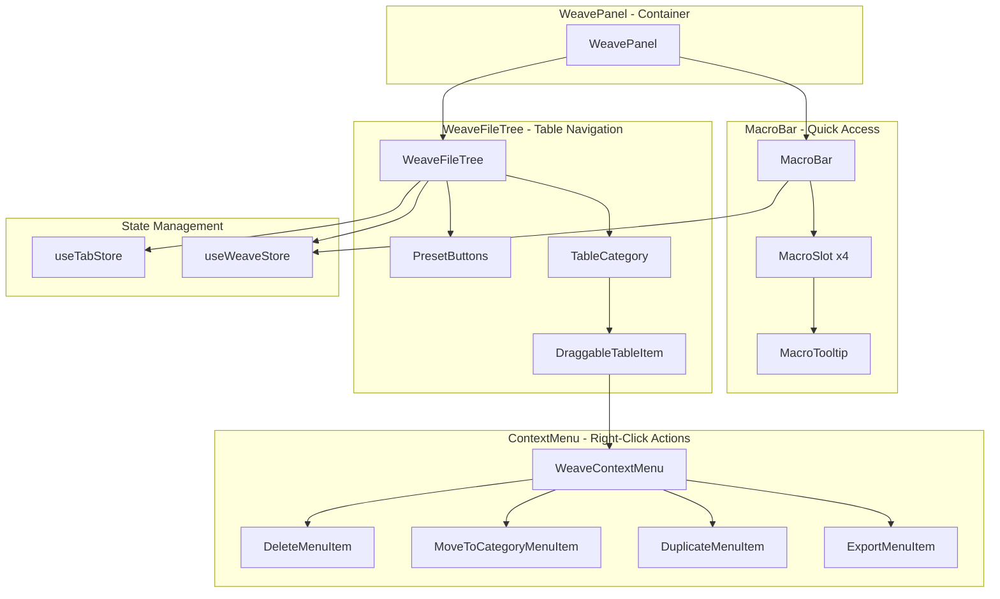
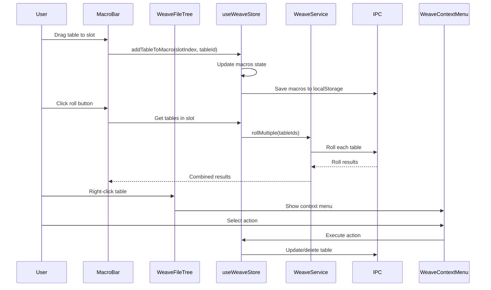

# Weave Left Panel Integration Plan

**Date**: 2026-01-15  
**Purpose**: Comprehensive integration plan for implementing missing left UI panel features from the-weave into anvil-and-loom-v2

---

## Executive Summary

This document provides a detailed plan for implementing the missing UI features from the-weave's left panel into anvil-and-loom-v2. The current implementation has a functional right panel ([`WeaveFileTree`](src/components/weave/WeaveFileTree.tsx:1)) but lacks several key features that were present in the original the-weave application.

**Key Finding**: The useWeaveStore already includes macro state and operations, and [`WeaveTableEditor`](src/components/weave/WeaveTableEditor.tsx:184-220) contains validation logic. However, @dnd-kit is not currently installed and must be added for drag-and-drop functionality.

**Priority Order**:
1. **MacroBar Component** (HIGH) - Quick roll macros for frequently used tables
2. **Drag-and-Drop Functionality** (HIGH) - Enables table reordering, category moves, and macro slot drops
3. **Context Menu** (MEDIUM) - Right-click operations on table items
4. **Preset Table Creation** (MEDIUM) - Quick create buttons for common table types
5. **Validation Badges** (LOW) - Visual indicators for table issues
6. **Table Tooltips** (LOW) - Hover tooltips showing table descriptions

---

## 1. Architecture Overview

### 1.1 Component Hierarchy



### 1.2 Data Flow Between Components



### 1.3 State Management Strategy

The existing [`useWeaveStore`](src/stores/useWeaveStore.ts:1) already contains macro state and operations. The integration will extend this store with additional state as needed:

**Current State**:
- `tables: Table[]` - All loaded tables
- `macros: MacroSlot[]` - 4 macro slots (already implemented)
- `rollLog: RollResult[]` - Roll history
- `selectedTableId: string | null` - Currently selected table
- `isLoading: boolean` - Loading state
- `error: string | null` - Error state

**State Extensions Needed**:
- `expandedCategories: Set<string>` - Track which categories are expanded (move from component to store)
- `draggedTableId: string | null` - Track currently dragged table
- `contextMenuTableId: string | null` - Track table for context menu
- `contextMenuPosition: { x: number, y: number } | null` - Position for context menu

**Persistence Strategy**:
- Macros: localStorage (already implemented in useWeaveStore)
- Expanded categories: localStorage (new)
- Tables: File system via IPC (already implemented)

---

## 2. Component Design Specifications

### 2.1 MacroBar Component

**File Path**: `src/components/weave/MacroBar.tsx`

**Purpose**: Display 4 macro slots for quick rolling of frequently used tables

**Props Interface**:
```typescript
interface MacroBarProps {
  onRoll?: (results: RollResult[]) => void;
  className?: string;
}
```

**State Requirements**:
- Local state: `hoveredSlotIndex: number | null` - For tooltip display
- Global state: `macros` from useWeaveStore

**Key Methods/Functions**:
```typescript
// Handle dropping a table into a slot
const handleDrop = (event: DragEvent, slotIndex: number) => void;

// Remove a table from a slot
const handleRemoveTable = (slotIndex: number, tableId: string) => void;

// Clear all tables from a slot
const handleClearSlot = (slotIndex: number) => void;

// Roll all tables in a slot
const handleRollSlot = (slotIndex: number) => Promise<RollResult[]>;

// Get tables for a slot
const getSlotTables = (slotIndex: number): Table[];
```

**Integration Points**:
- Reads `macros` from useWeaveStore
- Calls `addTableToMacro`, `removeTableFromMacro`, `clearMacro` from useWeaveStore
- Calls `rollMultiple` from useWeaveStore for rolling
- Drops from WeaveFileTree table items

**Visual Design**:
- Horizontal bar with 4 slots
- Each slot shows table count (e.g., "3/4")
- Hover shows MacroTooltip with table names
- Roll button on each slot
- Clear button (X) on each slot
- Empty slots show placeholder "Drop tables here"

**Drag-and-Drop Integration**:
- Each slot is a drop zone
- Accepts table IDs from WeaveFileTree
- Max 4 tables per slot (enforced by useWeaveStore)

### 2.2 MacroSlot Component

**File Path**: `src/components/weave/MacroSlot.tsx`

**Purpose**: Individual macro slot within MacroBar

**Props Interface**:
```typescript
interface MacroSlotProps {
  slotIndex: number;
  tables: Table[];
  onDrop: (slotIndex: number, event: DragEvent) => void;
  onRemoveTable: (slotIndex: number, tableId: string) => void;
  onClearSlot: (slotIndex: number) => void;
  onRoll: (slotIndex: number) => Promise<void>;
  isRolling: boolean;
}
```

**State Requirements**:
- Local state: `isHovered: boolean` - For visual feedback

**Key Methods/Functions**:
```typescript
// Handle drag over event
const handleDragOver = (event: DragEvent) => void;

// Handle drag leave event
const handleDragLeave = () => void;

// Handle drop event
const handleDrop = (event: DragEvent) => void;
```

**Integration Points**:
- Receives tables from MacroBar
- Calls parent callbacks for actions
- Displays MacroTooltip on hover

### 2.3 MacroTooltip Component

**File Path**: `src/components/weave/MacroTooltip.tsx`

**Purpose**: Display list of tables in a macro slot on hover

**Props Interface**:
```typescript
interface MacroTooltipProps {
  tables: Table[];
  position: { x: number, y: number };
  onClose: () => void;
}
```

**State Requirements**:
- None (controlled component)

**Key Methods/Functions**:
```typescript
// Calculate tooltip position to avoid overflow
const calculatePosition = () => { x: number, y: number };
```

**Integration Points**:
- Controlled by MacroSlot
- Displays table names from tables prop

**Visual Design**:
- Floating tooltip with dark background
- List of table names with icons
- Close button (X)
- Z-index to appear above other elements

### 2.4 DraggableTableItem Component

**File Path**: `src/components/weave/DraggableTableItem.tsx`

**Purpose**: Wrap table items in WeaveFileTree to make them draggable

**Props Interface**:
```typescript
interface DraggableTableItemProps {
  table: Table;
  children: React.ReactNode;
  onDragStart?: (tableId: string) => void;
  onDragEnd?: () => void;
}
```

**State Requirements**:
- Local state: `isDragging: boolean` - For visual feedback

**Key Methods/Functions**:
```typescript
// Handle drag start
const handleDragStart = (event: DragEvent) => void;

// Handle drag end
const handleDragEnd = () => void;
```

**Integration Points**:
- Wraps existing table item rendering in WeaveFileTree
- Sets drag data with table ID
- Calls parent callbacks for drag events

**Drag-and-Drop Integration**:
- Uses @dnd-kit's `useDraggable` hook
- Sets `data` attribute with table ID
- Provides visual feedback during drag

### 2.5 WeaveContextMenu Component

**File Path**: `src/components/weave/WeaveContextMenu.tsx`

**Purpose**: Right-click context menu for table operations

**Props Interface**:
```typescript
interface WeaveContextMenuProps {
  table: Table;
  position: { x: number, y: number };
  onClose: () => void;
  onExport: (format: 'json' | 'markdown') => void;
  onDuplicate: () => void;
  onMoveToCategory: (category: string) => void;
  onDelete: () => void;
}
```

**State Requirements**:
- None (controlled component)

**Key Methods/Functions**:
```typescript
// Handle export action
const handleExport = (format: 'json' | 'markdown') => void;

// Handle duplicate action
const handleDuplicate = () => void;

// Handle move to category action
const handleMoveToCategory = (category: string) => void;

// Handle delete action
const handleDelete = () => void;
```

**Integration Points**:
- Controlled by WeaveFileTree
- Calls useWeaveStore actions for operations
- Uses TableImportExport for export functionality

**Visual Design**:
- Floating menu with dark background
- Menu items with icons
- Hover effects
- Z-index to appear above other elements
- Click outside to close

### 2.6 PresetButtons Component

**File Path**: `src/components/weave/PresetButtons.tsx`

**Purpose**: Quick create buttons for common table types

**Props Interface**:
```typescript
interface PresetButtonsProps {
  onCreateTable: (preset: TablePreset) => void;
  disabled?: boolean;
}

type TablePreset = {
  name: string;
  maxRoll: number;
  tableData: TableRow[];
  description: string;
};
```

**State Requirements**:
- None (controlled component)

**Key Methods/Functions**:
```typescript
// Generate d66 table preset
const generateD66Preset = (): TablePreset;

// Generate d88 table preset
const generateD88Preset = (): TablePreset;

// Generate 2d6 table preset
const generate2d6Preset = (): TablePreset;

// Generate 2d8 table preset
const generate2d8Preset = (): TablePreset;
```

**Integration Points**:
- Calls useWeaveStore's createTable action
- Displays in WeaveFileTree header

**Visual Design**:
- Row of 4 buttons
- Each button shows die type (d66, d88, 2d6, 2d8)
- Hover effects
- Disabled state when loading

### 2.7 ValidationBadge Component

**File Path**: `src/components/weave/ValidationBadge.tsx`

**Purpose**: Display validation status badge on table items

**Props Interface**:
```typescript
interface ValidationBadgeProps {
  warnings: string[];
  isNotRollable: boolean;
}
```

**State Requirements**:
- None (controlled component)

**Key Methods/Functions**:
```typescript
// Get badge icon
const getBadgeIcon = () => React.ReactNode;

// Get badge tooltip
const getBadgeTooltip = () => string;
```

**Integration Points**:
- Receives validation warnings from WeaveTableEditor's validateTable function
- Displays in DraggableTableItem

**Visual Design**:
- ⚠️ icon for not rollable tables
- ⚡ icon for tables with warnings
- Small badge next to table name
- Hover tooltip showing all warnings

### 2.8 TableTooltip Component

**File Path**: `src/components/weave/TableTooltip.tsx`

**Purpose**: Display table description on hover

**Props Interface**:
```typescript
interface TableTooltipProps {
  table: Table;
  position: { x: number, y: number };
  onClose: () => void;
}
```

**State Requirements**:
- None (controlled component)

**Key Methods/Functions**:
```typescript
// Calculate tooltip position to avoid overflow
const calculatePosition = () => { x: number, y: number };
```

**Integration Points**:
- Controlled by DraggableTableItem
- Displays table.description

**Visual Design**:
- Floating tooltip with dark background
- Table name and description
- Table stats (row count, die type)
- Close button (X)
- Z-index to appear above other elements

---

## 3. Implementation Phases

### Phase 1: MacroBar Component (HIGH PRIORITY)

**Objective**: Implement quick roll macros for frequently used tables

**Dependencies**: None (standalone component)

**Tasks**:
1. Install @dnd-kit dependencies
2. Create MacroBar component
3. Create MacroSlot component
4. Create MacroTooltip component
5. Integrate MacroBar into WeavePanel
6. Test macro slot persistence (localStorage)
7. Test drag-and-drop from WeaveFileTree to macro slots
8. Test rolling multiple tables from a slot

**Completion Criteria**:
- MacroBar displays 4 slots in WeavePanel
- Tables can be dragged to macro slots (max 4 per slot)
- Hover shows MacroTooltip with table names
- Roll button rolls all tables in slot and combines results with "+"
- Clear button removes all tables from slot
- Macro slots persist across sessions (localStorage)

**Estimated Complexity**: Medium

### Phase 2: Drag-and-Drop Infrastructure (HIGH PRIORITY)

**Objective**: Enable drag-and-drop for table reordering and category moves

**Dependencies**: @dnd-kit installation (from Phase 1)

**Tasks**:
1. Install @dnd-kit packages
2. Create DraggableTableItem component
3. Integrate DraggableTableItem into WeaveFileTree
4. Add drag handles to table items
5. Implement table reordering within categories
6. Implement moving tables between categories
7. Test drag-and-drop to MacroBar slots
8. Ensure no conflicts with other panes

**Completion Criteria**:
- Table items are draggable with visual feedback
- Tables can be reordered within a category
- Tables can be moved between categories
- Tables can be dragged to MacroBar slots
- Drag-and-drop works without conflicts with other panes

**Estimated Complexity**: High

### Phase 3: Context Menu (MEDIUM PRIORITY)

**Objective**: Implement right-click context menu for table operations

**Dependencies**: None (can be implemented independently)

**Tasks**:
1. Create WeaveContextMenu component
2. Add context menu state to useWeaveStore
3. Implement right-click handler on table items
4. Implement export table (JSON/Markdown)
5. Implement duplicate table
6. Implement move to category
7. Implement delete table
8. Test all context menu actions

**Completion Criteria**:
- Right-clicking a table shows context menu
- Export table downloads JSON or Markdown file
- Duplicate table creates a copy with new ID
- Move to category changes table.category field
- Delete table removes table from file system and store
- Context menu closes on click outside

**Estimated Complexity**: Medium

### Phase 4: Preset Table Creation (MEDIUM PRIORITY)

**Objective**: Add quick create buttons for common table types

**Dependencies**: None (can be implemented independently)

**Tasks**:
1. Create PresetButtons component
2. Implement d66 preset generator
3. Implement d88 preset generator
4. Implement 2d6 preset generator
5. Implement 2d8 preset generator
6. Integrate PresetButtons into WeaveFileTree header
7. Test preset table creation
8. Test that preset tables are rollable

**Completion Criteria**:
- 4 preset buttons display in WeaveFileTree header
- Clicking a button creates a new table with pre-configured rows
- d66 preset has 36 rows (1-1 to 6-6)
- d88 preset has 64 rows (1-1 to 8-8)
- 2d6 preset has 11 rows (2 to 12)
- 2d8 preset has 15 rows (2 to 16)
- Preset tables open in new tabs after creation

**Estimated Complexity**: Low-Medium

### Phase 5: Validation Badges and Tooltips (LOW PRIORITY)

**Objective**: Add visual indicators for table validation and descriptions

**Dependencies**: WeaveTableEditor validation logic (already exists)

**Tasks**:
1. Create ValidationBadge component
2. Create TableTooltip component
3. Integrate ValidationBadge into DraggableTableItem
4. Integrate TableTooltip into DraggableTableItem
5. Add hover handlers for tooltips
6. Test validation badge display
7. Test table tooltip display

**Completion Criteria**:
- ⚠️ badge displays on tables that are not rollable
- ⚡ badge displays on tables with warnings
- Hovering badge shows all warnings
- Hovering table name shows description tooltip
- Tooltips position correctly to avoid overflow
- Tooltips close on mouse leave or click outside

**Estimated Complexity**: Low

---

## 4. Data Model Extensions

### 4.1 useWeaveStore Extensions

**File**: `src/stores/useWeaveStore.ts`

**New State Properties**:
```typescript
interface WeaveStore {
  // Existing state...
  
  // NEW: UI state for drag-and-drop
  draggedTableId: string | null;
  contextMenuTableId: string | null;
  contextMenuPosition: { x: number, y: number } | null;
  
  // NEW: Expanded categories (move from component to store)
  expandedCategories: Set<string>;
  
  // NEW: Actions
  setDraggedTableId: (tableId: string | null) => void;
  setContextMenuTable: (tableId: string | null, position: { x: number, y: number } | null) => void;
  toggleCategory: (category: string) => void;
  setExpandedCategories: (categories: Set<string>) => void;
}
```

**Persistence Strategy**:
- `macros`: localStorage key `'weave-macros'` (already implemented)
- `expandedCategories`: localStorage key `'weave-expanded-categories'` (new)

**Implementation**:
```typescript
// Load from localStorage on store initialization
const loadFromLocalStorage = () => {
  const savedMacros = localStorage.getItem('weave-macros');
  const savedExpandedCategories = localStorage.getItem('weave-expanded-categories');
  
  return {
    macros: savedMacros ? JSON.parse(savedMacros) : [{ tables: [] }, { tables: [] }, { tables: [] }, { tables: [] }],
    expandedCategories: savedExpandedCategories ? new Set(JSON.parse(savedExpandedCategories)) : new Set(),
  };
};

// Save to localStorage on state change
const saveToLocalStorage = (key: string, value: unknown) => {
  localStorage.setItem(key, JSON.stringify(value));
};
```

### 4.2 TypeScript Interfaces

**File**: `src/types/weave.ts`

**New Interfaces**:
```typescript
// Drag-and-drop types
export interface DragData {
  type: 'table';
  tableId: string;
}

export interface DropZone {
  type: 'macro-slot' | 'category' | 'table-reorder';
  slotIndex?: number;
  category?: string;
  insertIndex?: number;
}

// Context menu types
export interface ContextMenuAction {
  type: 'export' | 'duplicate' | 'move' | 'delete';
  payload?: unknown;
}

// Preset table types
export interface TablePreset {
  name: string;
  maxRoll: number;
  tableData: TableRow[];
  description: string;
  category?: string;
  tags?: string[];
}
```

### 4.3 Validation Types

**File**: `src/types/weave.ts`

**New Interfaces**:
```typescript
export interface TableValidation {
  isRollable: boolean;
  warnings: string[];
  errors: string[];
}

export type ValidationSeverity = 'error' | 'warning' | 'info';
```

---

## 5. Drag-and-Drop Strategy

### 5.1 @dnd-kit Integration

**Dependencies to Install**:
```bash
npm install @dnd-kit/core @dnd-kit/sortable @dnd-kit/utilities
```

**Version**: Latest stable (compatible with React 19)

### 5.2 Drag Handle Placement

**Strategy**:
1. Wrap entire table item in DraggableTableItem
2. Use `useDraggable` hook from @dnd-kit
3. Set drag handle to entire table item row
4. Provide visual feedback during drag (opacity, border)

**Implementation**:
```typescript
// In DraggableTableItem
const { attributes, listeners, setNodeRef, transform, isDragging } = useDraggable({
  id: table.id,
  data: {
    type: 'table',
    tableId: table.id,
  },
});

// Apply transform and opacity
const style = {
  transform: CSS.Transform.toString(transform),
  opacity: isDragging ? 0.5 : 1,
};
```

### 5.3 Drop Zones

**Three Types of Drop Zones**:

1. **Macro Slot Drop Zone**:
   - Type: `'macro-slot'`
   - Accepts: Tables (any category)
   - Action: Add table to macro slot
   - Max: 4 tables per slot

2. **Category Drop Zone**:
   - Type: `'category'`
   - Accepts: Tables
   - Action: Move table to new category
   - Updates: `table.category` field

3. **Table Reorder Drop Zone**:
   - Type: `'table-reorder'`
   - Accepts: Tables (same category only)
   - Action: Reorder tables within category
   - Updates: Table order in store (or file system)

**Implementation**:
```typescript
// In WeaveFileTree
const sensors = useSensors(
  useSensor(PointerSensor),
  useSensor(KeyboardSensor, {
    coordinateGetter: sortableKeyboardCoordinates,
  })
);

const handleDragOver = (event: DragOverEvent) => {
  const { active, over } = event;
  if (!over) return;
  
  const activeId = active.id as string;
  const overId = over.id as string;
  
  // Determine drop zone type
  const overData = over.data.current as DropZone;
  
  if (overData.type === 'macro-slot') {
    // Handle macro slot drop
  } else if (overData.type === 'category') {
    // Handle category drop
  } else if (overData.type === 'table-reorder') {
    // Handle table reorder
  }
};
```

### 5.4 Conflict Avoidance

**Strategy**:
1. Use unique IDs for each DndContext
2. Scope drag-and-drop to WeavePanel only
3. Disable drag-and-drop in other panes when WeavePanel is active
4. Test drag-and-drop between panes

**Implementation**:
```typescript
// In WeavePanel
<DndContext
  sensors={sensors}
  collisionDetection={closestCenter}
  onDragStart={handleDragStart}
  onDragOver={handleDragOver}
  onDragEnd={handleDragEnd}
  id="weave-dnd-context" // Unique ID
>
  <MacroBar />
  <WeaveFileTree />
</DndContext>
```

### 5.5 Visual Feedback

**Drag States**:
- `isDragging`: Reduce opacity to 0.5
- `dragOverlay`: Show ghost image of dragged item
- `dropAnimation`: Smooth animation when dropping

**Drop Zone States**:
- `isOver`: Highlight drop zone with border
- `isDragOver`: Change background color

**Implementation**:
```typescript
// In MacroSlot
const { setNodeRef, isOver } = useDroppable({
  id: `macro-slot-${slotIndex}`,
  data: {
    type: 'macro-slot',
    slotIndex,
  },
});

const className = `macro-slot ${isOver ? 'is-over' : ''}`;
```

---

## 6. Integration Points

### 6.1 WeavePanel Modifications

**File**: `src/components/weave/WeavePanel.tsx`

**Current Implementation**:
```typescript
export function WeavePanel() {
  return (
    <div className="flex flex-col h-full">
      <div className="flex-1 min-h-0 overflow-hidden">
        <WeaveFileTree />
      </div>
    </div>
  );
}
```

**Modified Implementation**:
```typescript
import { DndContext } from '@dnd-kit/core';
import { PointerSensor, useSensor, useSensors } from '@dnd-kit/core';
import { MacroBar } from './MacroBar';
import { WeaveFileTree } from './WeaveFileTree';
import { useWeaveStore } from '../../stores/useWeaveStore';

export function WeavePanel() {
  const { setDraggedTableId, setContextMenuTable } = useWeaveStore();
  
  const sensors = useSensors(
    useSensor(PointerSensor, {
      activationConstraint: {
        distance: 8,
      },
    })
  );
  
  const handleDragStart = (event: DragStartEvent) => {
    const { active } = event;
    const activeData = active.data.current as DragData;
    if (activeData?.type === 'table') {
      setDraggedTableId(activeData.tableId);
    }
  };
  
  const handleDragEnd = (event: DragEndEvent) => {
    setDraggedTableId(null);
    setContextMenuTable(null, null);
  };
  
  return (
    <div className="flex flex-col h-full">
      <DndContext
        sensors={sensors}
        onDragStart={handleDragStart}
        onDragEnd={handleDragEnd}
        id="weave-dnd-context"
      >
        <MacroBar />
        <div className="flex-1 min-h-0 overflow-hidden">
          <WeaveFileTree />
        </div>
      </DndContext>
    </div>
  );
}
```

### 6.2 WeaveFileTree Enhancements

**File**: `src/components/weave/WeaveFileTree.tsx`

**Modifications**:

1. **Wrap Table Items in DraggableTableItem**:
```typescript
import { DraggableTableItem } from './DraggableTableItem';
import { ValidationBadge } from './ValidationBadge';
import { TableTooltip } from './TableTooltip';

// In table item rendering:
<DraggableTableItem table={table}>
  <div className="group flex items-center gap-2 px-2 py-1.5 rounded cursor-pointer transition-colors">
    <FileText className="w-4 h-4 flex-shrink-0 text-slate-500" />
    <div className="flex-1 min-w-0">
      <div className="text-sm font-medium truncate flex items-center gap-2">
        {table.name}
        <ValidationBadge warnings={validateTable(table).warnings} isNotRollable={!isTableRollable(table)} />
      </div>
      <div className="text-xs text-slate-500 truncate">
        {getRowCountText(table)} · {getDieTypeText(table.maxRoll)}
      </div>
    </div>
    {/* Action buttons */}
  </div>
  {showTooltip && <TableTooltip table={table} position={tooltipPosition} onClose={() => setShowTooltip(false)} />}
</DraggableTableItem>
```

2. **Add Right-Click Handler**:
```typescript
const handleContextMenu = (e: React.MouseEvent, table: Table) => {
  e.preventDefault();
  setContextMenuTable(table.id, { x: e.clientX, y: e.clientY });
};

// In table item rendering:
<div onContextMenu={(e) => handleContextMenu(e, table)}>
```

3. **Add Preset Buttons to Header**:
```typescript
import { PresetButtons } from './PresetButtons';

// In header, after action buttons:
<PresetButtons onCreateTable={handleCreatePresetTable} disabled={isLoading} />
```

4. **Move Expanded Categories to Store**:
```typescript
// Remove local state:
// const [expandedCategories, setExpandedCategories] = useState<Set<string>>(new Set());

// Use store instead:
const { expandedCategories, toggleCategory } = useWeaveStore();
```

### 6.3 Context Menu Attachment

**File**: `src/components/weave/WeaveFileTree.tsx`

**Add Context Menu Rendering**:
```typescript
import { WeaveContextMenu } from './WeaveContextMenu';
import { useWeaveStore } from '../../stores/useWeaveStore';

export function WeaveFileTree() {
  const { contextMenuTableId, contextMenuPosition, tables } = useWeaveStore();
  
  const contextMenuTable = contextMenuTableId 
    ? tables.find(t => t.id === contextMenuTableId)
    : null;
  
  return (
    <div className="flex flex-col h-full">
      {/* Existing content */}
      
      {/* Context Menu */}
      {contextMenuTable && contextMenuPosition && (
        <WeaveContextMenu
          table={contextMenuTable}
          position={contextMenuPosition}
          onClose={() => setContextMenuTable(null, null)}
          onExport={handleExport}
          onDuplicate={handleDuplicate}
          onMoveToCategory={handleMoveToCategory}
          onDelete={handleDelete}
        />
      )}
    </div>
  );
}
```

---

## 7. Testing Strategy

### 7.1 Unit Test Considerations

**MacroBar Component**:
- Test that 4 slots render correctly
- Test that tables can be added to slots
- Test that max 4 tables per slot is enforced
- Test that tables can be removed from slots
- Test that slots can be cleared
- Test that rolling a slot calls rollMultiple with correct table IDs

**MacroSlot Component**:
- Test drag over event handling
- Test drag leave event handling
- Test drop event handling
- Test that visual feedback is applied correctly

**DraggableTableItem Component**:
- Test that drag start event sets correct data
- Test that drag end event clears drag state
- Test that visual feedback is applied during drag
- Test that drag handle works correctly

**WeaveContextMenu Component**:
- Test that all menu items render correctly
- Test that export action calls correct function
- Test that duplicate action calls correct function
- Test that move to category action calls correct function
- Test that delete action calls correct function
- Test that context menu closes on click outside

**PresetButtons Component**:
- Test that 4 buttons render correctly
- Test that d66 preset generates correct table
- Test that d88 preset generates correct table
- Test that 2d6 preset generates correct table
- Test that 2d8 preset generates correct table
- Test that onCreateTable callback is called with correct preset

**ValidationBadge Component**:
- Test that ⚠️ badge displays for not rollable tables
- Test that ⚡ badge displays for tables with warnings
- Test that badge tooltip shows all warnings
- Test that no badge displays for valid tables

**TableTooltip Component**:
- Test that tooltip displays table name and description
- Test that tooltip displays table stats
- Test that tooltip positions correctly
- Test that tooltip closes on click outside

### 7.2 Integration Test Scenarios

**Scenario 1: Drag Table to Macro Slot**
1. User opens WeavePanel
2. User sees a table in WeaveFileTree
3. User drags table to MacroBar slot 1
4. Slot 1 shows table count "1/4"
5. User hovers over slot 1
6. MacroTooltip shows table name
7. User clicks roll button on slot 1
8. Table rolls and result is displayed

**Scenario 2: Reorder Tables Within Category**
1. User opens WeavePanel
2. User sees multiple tables in "Oracle" category
3. User drags table A to position between table B and table C
4. Table A moves to new position
5. Table order is persisted to file system

**Scenario 3: Move Table Between Categories**
1. User opens WeavePanel
2. User sees table in "Oracle" category
3. User drags table to "Encounter" category
4. Table moves to "Encounter" category
5. Table's category field is updated
6. Change is persisted to file system

**Scenario 4: Right-Click Context Menu**
1. User opens WeavePanel
2. User right-clicks on a table
3. Context menu appears at cursor position
4. User clicks "Export JSON"
5. Table is exported as JSON file
6. User right-clicks on same table
7. User clicks "Duplicate"
8. New table is created with same data
9. User right-clicks on new table
10. User clicks "Delete"
11. Table is deleted from file system

**Scenario 5: Preset Table Creation**
1. User opens WeavePanel
2. User clicks "d66" preset button
3. New table is created with 36 rows
4. Table opens in new tab
5. User clicks "2d6" preset button
6. New table is created with 11 rows
7. Table opens in new tab

**Scenario 6: Validation Badge Display**
1. User opens WeavePanel
2. User sees table with gaps in roll ranges
3. ⚡ badge displays next to table name
4. User hovers over badge
5. Tooltip shows gap warnings
6. User sees table with no rows
7. ⚠️ badge displays next to table name
8. User hovers over badge
9. Tooltip shows "Table has no rows"

**Scenario 7: Table Tooltip Display**
1. User opens WeavePanel
2. User hovers over table name
3. TableTooltip appears showing description
4. Tooltip shows table stats (row count, die type)
5. User moves mouse away
6. Tooltip disappears

### 7.3 User Acceptance Criteria

**MacroBar**:
- [ ] MacroBar displays 4 slots in WeavePanel
- [ ] Tables can be dragged to macro slots
- [ ] Max 4 tables per slot is enforced
- [ ] Hover shows MacroTooltip with table names
- [ ] Roll button rolls all tables in slot
- [ ] Results are combined with "+"
- [ ] Clear button removes all tables from slot
- [ ] Macro slots persist across sessions

**Drag-and-Drop**:
- [ ] Table items are draggable
- [ ] Visual feedback is provided during drag
- [ ] Tables can be reordered within categories
- [ ] Tables can be moved between categories
- [ ] Tables can be dragged to macro slots
- [ ] Drag-and-drop works without conflicts with other panes

**Context Menu**:
- [ ] Right-clicking a table shows context menu
- [ ] Export table downloads JSON file
- [ ] Export table downloads Markdown file
- [ ] Duplicate table creates a copy
- [ ] Move to category changes table category
- [ ] Delete table removes table
- [ ] Context menu closes on click outside

**Preset Buttons**:
- [ ] 4 preset buttons display in WeaveFileTree header
- [ ] d66 preset creates table with 36 rows
- [ ] d88 preset creates table with 64 rows
- [ ] 2d6 preset creates table with 11 rows
- [ ] 2d8 preset creates table with 15 rows
- [ ] Preset tables open in new tabs

**Validation Badges**:
- [ ] ⚠️ badge displays on not rollable tables
- [ ] ⚡ badge displays on tables with warnings
- [ ] Hovering badge shows all warnings
- [ ] No badge displays on valid tables

**Table Tooltips**:
- [ ] Hovering table name shows description
- [ ] Tooltip shows table stats
- [ ] Tooltip positions correctly
- [ ] Tooltip closes on mouse leave

---

## 8. Risk Assessment

### 8.1 Potential Issues

**Issue 1: Drag-and-Drop Conflicts**
- **Impact**: High
- **Likelihood**: Medium
- **Description**: @dnd-kit contexts might conflict between Tapestry and Weave panes
- **Mitigation**:
  - Use unique IDs for each DndContext
  - Scope drag-and-drop to specific panes
  - Test drag-and-drop between panes thoroughly
  - Consider disabling drag-and-drop in one pane when other is active

**Issue 2: Performance with Large Table Sets**
- **Impact**: Medium
- **Likelihood**: Low
- **Description**: Rendering many tables with drag-and-drop and tooltips may cause performance issues
- **Mitigation**:
  - Implement virtual scrolling for large table lists
  - Lazy load tooltips
  - Debounce drag events
  - Test with 100+ tables

**Issue 3: localStorage Persistence Issues**
- **Impact**: Medium
- **Likelihood**: Low
- **Description**: localStorage may fail or be cleared, causing loss of macro and category state
- **Mitigation**:
  - Add error handling for localStorage operations
  - Provide default values when localStorage is empty
  - Consider migrating to file system persistence for macros

**Issue 4: Context Menu Positioning**
- **Impact**: Low
- **Likelihood**: Medium
- **Description**: Context menu may appear off-screen or overlap with other elements
- **Mitigation**:
  - Calculate position dynamically to avoid overflow
  - Use fixed positioning with z-index
  - Test on different screen sizes and resolutions

**Issue 5: Validation Logic Performance**
- **Impact**: Low
- **Likelihood**: Low
- **Description**: Validating tables on every render may cause performance issues
- **Mitigation**:
  - Memoize validation results
  - Only validate on table changes
  - Debounce validation calls

**Issue 6: Tooltip Z-Index Conflicts**
- **Impact**: Low
- **Likelihood**: Medium
- **Description**: Tooltips may appear behind other elements
- **Mitigation**:
  - Use high z-index values for tooltips
  - Test tooltip rendering with different panel configurations
  - Ensure tooltips are rendered outside of overflow containers

### 8.2 Backward Compatibility Concerns

**Concern 1: Breaking Changes to useWeaveStore**
- **Impact**: Medium
- **Likelihood**: Low
- **Description**: Adding new state properties to useWeaveStore may break existing code
- **Mitigation**:
  - Use optional chaining for new properties
  - Provide default values
  - Test all existing Weave functionality after changes

**Concern 2: File System Structure Changes**
- **Impact**: Low
- **Likelihood**: Low
- **Description**: Changes to table file structure may break existing tapestries
- **Mitigation**:
  - Maintain backward compatibility with existing table files
  - Use schema versioning for table format
  - Test with existing tapestries

### 8.3 Performance Considerations

**Consideration 1: Drag-and-Drop Overhead**
- **Impact**: Medium
- **Description**: @dnd-kit adds overhead to rendering
- **Mitigation**:
  - Use `useMemo` for expensive calculations
  - Implement lazy loading for large lists
  - Test performance with 100+ tables

**Consideration 2: Tooltip Rendering**
- **Impact**: Low
- **Description**: Rendering tooltips on hover may cause layout thrashing
- **Mitigation**:
  - Use CSS transforms for positioning
  - Debounce tooltip appearance
  - Use fixed positioning to avoid reflows

**Consideration 3: Validation Computation**
- **Impact**: Low
- **Description**: Validating tables on every render may be expensive
- **Mitigation**:
  - Memoize validation results
  - Only validate when table data changes
  - Use web workers for heavy validation

---

## 9. File Structure

### 9.1 New Files to Create

```
src/components/weave/
├── MacroBar.tsx                    # NEW: Macro bar container
├── MacroSlot.tsx                   # NEW: Individual macro slot
├── MacroTooltip.tsx                # NEW: Macro slot tooltip
├── DraggableTableItem.tsx          # NEW: Draggable wrapper for table items
├── WeaveContextMenu.tsx            # NEW: Right-click context menu
├── PresetButtons.tsx               # NEW: Preset table creation buttons
├── ValidationBadge.tsx             # NEW: Validation status badge
└── TableTooltip.tsx                # NEW: Table description tooltip
```

### 9.2 Existing Files to Modify

```
src/components/weave/
├── WeavePanel.tsx                  # MODIFY: Add DndContext and MacroBar
└── WeaveFileTree.tsx              # MODIFY: Add drag-and-drop, context menu, presets, badges

src/stores/
└── useWeaveStore.ts               # MODIFY: Add UI state for drag-and-drop and context menu

src/types/
└── weave.ts                       # MODIFY: Add drag-and-drop and validation types

package.json                       # MODIFY: Add @dnd-kit dependencies
```

### 9.3 Expected File Organization

```
src/
├── components/
│   └── weave/
│       ├── WeavePanel.tsx          # Container with DndContext
│       ├── WeaveFileTree.tsx      # Enhanced with drag-and-drop
│       ├── WeaveTableEditor.tsx   # Existing (no changes)
│       ├── WeaveAIPanel.tsx       # Existing (no changes)
│       ├── CreateTableModal.tsx    # Existing (no changes)
│       ├── TableImportExport.tsx    # Existing (no changes)
│       ├── MacroBar.tsx            # NEW: Macro bar container
│       ├── MacroSlot.tsx           # NEW: Individual macro slot
│       ├── MacroTooltip.tsx        # NEW: Macro slot tooltip
│       ├── DraggableTableItem.tsx  # NEW: Draggable wrapper
│       ├── WeaveContextMenu.tsx    # NEW: Context menu
│       ├── PresetButtons.tsx       # NEW: Preset buttons
│       ├── ValidationBadge.tsx     # NEW: Validation badge
│       └── TableTooltip.tsx        # NEW: Table tooltip
├── stores/
│   └── useWeaveStore.ts          # Extended with UI state
├── types/
│   └── weave.ts                  # Extended with new types
└── core/
    └── weave/
        ├── WeaveService.ts        # Existing (no changes)
        ├── RandomTableEngine.ts   # Existing (no changes)
        ├── TokenResolver.ts      # Existing (no changes)
        └── weaveRollLogger.ts    # Existing (no changes)
```

---

## 10. Implementation Checklist

### Phase 1: MacroBar Component
- [ ] Install @dnd-kit dependencies
- [ ] Create MacroBar component
- [ ] Create MacroSlot component
- [ ] Create MacroTooltip component
- [ ] Integrate MacroBar into WeavePanel
- [ ] Test macro slot persistence (localStorage)
- [ ] Test drag-and-drop from WeaveFileTree to macro slots
- [ ] Test rolling multiple tables from a slot

### Phase 2: Drag-and-Drop Infrastructure
- [ ] Create DraggableTableItem component
- [ ] Integrate DraggableTableItem into WeaveFileTree
- [ ] Add drag handles to table items
- [ ] Implement table reordering within categories
- [ ] Implement moving tables between categories
- [ ] Test drag-and-drop to MacroBar slots
- [ ] Ensure no conflicts with other panes

### Phase 3: Context Menu
- [ ] Create WeaveContextMenu component
- [ ] Add context menu state to useWeaveStore
- [ ] Implement right-click handler on table items
- [ ] Implement export table (JSON/Markdown)
- [ ] Implement duplicate table
- [ ] Implement move to category
- [ ] Implement delete table
- [ ] Test all context menu actions

### Phase 4: Preset Table Creation
- [ ] Create PresetButtons component
- [ ] Implement d66 preset generator
- [ ] Implement d88 preset generator
- [ ] Implement 2d6 preset generator
- [ ] Implement 2d8 preset generator
- [ ] Integrate PresetButtons into WeaveFileTree header
- [ ] Test preset table creation
- [ ] Test that preset tables are rollable

### Phase 5: Validation Badges and Tooltips
- [ ] Create ValidationBadge component
- [ ] Create TableTooltip component
- [ ] Integrate ValidationBadge into DraggableTableItem
- [ ] Integrate TableTooltip into DraggableTableItem
- [ ] Add hover handlers for tooltips
- [ ] Test validation badge display
- [ ] Test table tooltip display

### Testing
- [ ] Write unit tests for all new components
- [ ] Write integration tests for drag-and-drop
- [ ] Write integration tests for context menu
- [ ] Write integration tests for preset buttons
- [ ] Write integration tests for validation badges
- [ ] Manual testing of all features
- [ ] Cross-platform testing (Windows, macOS, Linux)
- [ ] Performance testing with large table sets

---

## 11. Conclusion

This integration plan provides a comprehensive roadmap for implementing the missing left UI panel features from the-weave into anvil-and-loom-v2. The phased approach ensures that each feature is implemented and tested before moving to the next phase.

**Key Decisions**:
1. **MacroBar first**: Highest priority, standalone component with clear value
2. **Drag-and-drop second**: Enables multiple features (reordering, category moves, macro drops)
3. **Context menu third**: Adds powerful table management capabilities
4. **Preset buttons fourth**: Improves table creation workflow
5. **Validation badges and tooltips fifth**: Nice-to-have visual enhancements

**Most Complex Aspects**:
1. **Drag-and-drop integration**: Requires careful coordination between multiple components
2. **Context menu positioning**: Must handle edge cases and screen boundaries
3. **Performance with large table sets**: Requires optimization strategies

**Risk Mitigation**:
1. Use unique DndContext IDs to avoid conflicts
2. Implement error handling for localStorage operations
3. Memoize expensive computations
4. Test thoroughly with various scenarios

With careful implementation and thorough testing, these features can be successfully integrated while maintaining the existing functionality and user experience of anvil-and-loom-v2.

---

**Document Version**: 1.0  
**Last Updated**: 2026-01-15
